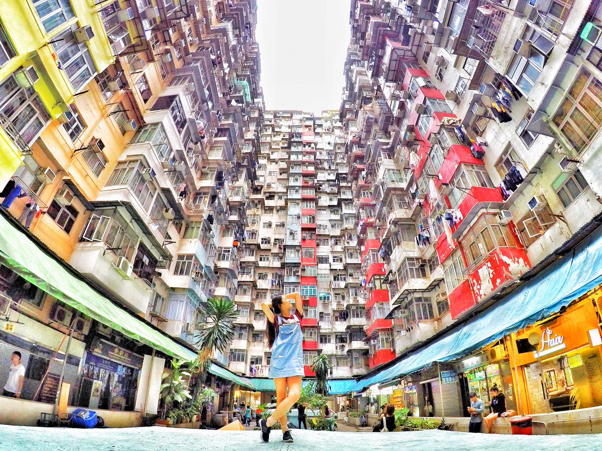
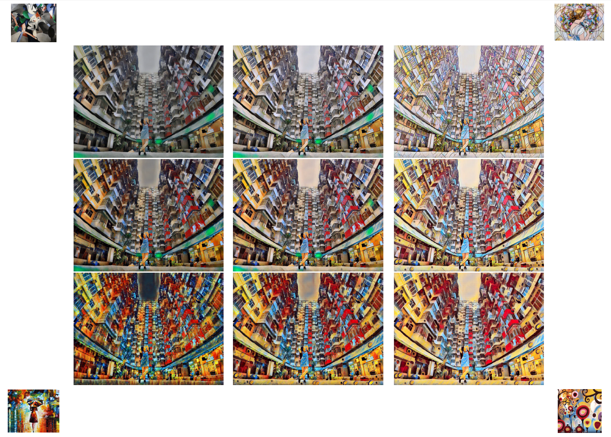

# Multiple Style Combine & Transfer - Image / Video
It is based on the pytorch [fast-neural-style](https://github.com/pytorch/examples/tree/master/fast_neural_style) example for artistic style transfer. We further modifies the instance normalization in the transform network, making it conditional with multiple style images. So, you can combine effects from multiple style images and transfer to a target image. We also use this model to transfer videos in the multiple-style-combined ways. But note that the video style transfer is not real time. The video is pre-processed frame-by-frame and converted back to video after style transfer.

### Training content image datasets
[COCO 2014 Training images dataset [83K/13GB]](http://images.cocodataset.org/zips/train2014.zip)


## Usage

Train
```
python neural_style.py train --dataset </path/to/train-dataset> --style-image </path/to/style/image> --save-model-dir </path/to/save-model/folder> --epochs 2 --cuda 1 --batch-size 4
```
* `--style-image`: the code will grab all files under the path as style images
* `--batch-size`: number of images fed in each batch does not need to be the same to the number of style images

Stylize 
```
python neural_style.py eval --content-image </path/to/content/image> --model </path/to/saved/model> --output-image </path/to/output/image> --cuda 0 --style-num 19 --style-id 18
```
* `--dataset`: path to training dataset, the path should point to a folder containing another folder with all the training images
* `--style-num`: total number of style images, must be the same as the amount used in training
* `--style-id`: a number from `0` to `style_num - 1`, indicating which style to transfer to


## Results

### Pretrained model
Trained models are saved in the **trained_models** folder

<div align='center'>
  		
</div>

<p>

</p>
Figure1. Using one model and making multi style transfer image. Center image is mixed with 4 style
